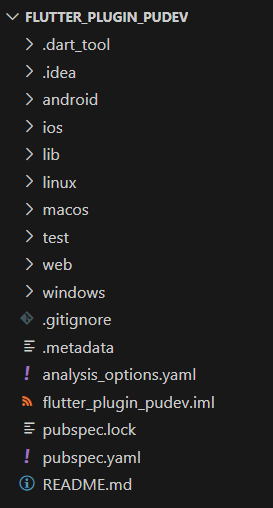
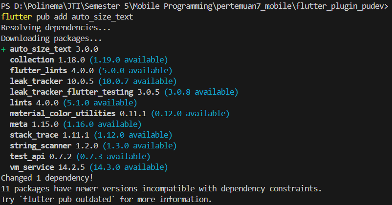
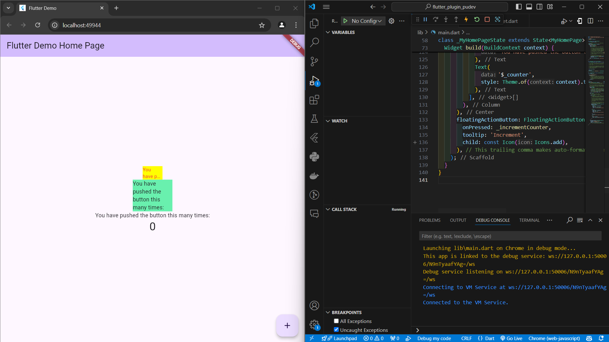

# **Pemrograman Mobile Pertemuan Minggu 7**

| Nama  :   | Haidar Aly |
| :--------: | :-------: |

| Kelas :  | TI-3F    |
| :--------: | :-------: |

| Absen : |  09  |
| :--------: | :-------: |

| NIM   :  | 2241720258   |
| :--------: | :-------: |

## Praktikum Plugin

### Langkah 1 - Buat Project Baru
<>

### Langkah 2 - Menambahkan Plugin
<>

### Langkah 3 - Buat file `red_text_widget`.dart
```dart
import 'package:flutter/material.dart';

class RedTextWidget extends StatelessWidget {
  // ignore: use_super_parameters
  const RedTextWidget({Key? key}) : super(key: key);

  @override
  Widget build(BuildContext context) {
    return Container();
  }
}
```

### Langkah 4 - Tambah Widget AutoSizeText
```dart
import 'package:auto_size_text/auto_size_text.dart';
import 'package:flutter/material.dart';

class RedTextWidget extends StatelessWidget {
  // ignore: use_super_parameters
  const RedTextWidget({Key? key}) : super(key: key);

  @override
  Widget build(BuildContext context) {
    return AutoSizeText(
      text,
      style: TextStyle(
        color: Colors.red,
        fontSize: 14,
      ),
      maxLines: 2,
      overflow: TextOverflow.ellipsis,
    );
  }
}
```
- Alasan Error = karena text tidak terdefinisi atau tidak terdeklarasi

### Langkah 5 - Buat Variabel text dan parameter di constructor
```dart
import 'package:auto_size_text/auto_size_text.dart';
import 'package:flutter/material.dart';

class RedTextWidget extends StatelessWidget {
  final String text;
  // ignore: use_super_parameters
  const RedTextWidget({Key? key, required this.text}) : super(key: key);

  @override
  Widget build(BuildContext context) {
    return AutoSizeText(
      text,
      style: const TextStyle(
        color: Colors.red,
        fontSize: 14,
      ),
      maxLines: 2,
      overflow: TextOverflow.ellipsis,
    );
  }
}
```

### Langkah 6 - Tambahkan widget di main.dart
```dart
children: <Widget>[
    Container(
        color: Colors.yellowAccent,
        width: 50,
        child: const RedTextWidget(
            text: 'You have pushed the button this many times:',
        ),
    ),
    Container(
        color: Colors.greenAccent,
        width: 100,
        child: const Text(
            'You have pushed the button this many times:',
        ),
    ),
    const Text(
        'You have pushed the button this many times:',
    ),
    Text(
        '$_counter',
        style: Theme.of(context).textTheme.headlineMedium,
    ),
],
```

### Hasil
<>

### Tugas Praktikum

#### Nomor 2 - Jelaskan maksud dari langkah 2 pada praktikum tersebut!
Perintah `flutter pub add auto_size_text` digunakan untuk menambahkan dependency `auto_size_text` ke dalam proyek Flutter. Dependency ini memungkinkan untuk menggunakan widget `AutoSizeText`, yang secara otomatis menyesuaikan ukuran teks agar sesuai dengan batas yang ditentukan, sehingga teks tidak terpotong dan tetap terbaca dengan baik pada berbagai ukuran layar.

#### Nomor 3 - Jelaskan maksud dari langkah 5 pada praktikum tersebut!
- Variabel text adalah variabel final yang menyimpan teks dan nilainya tidak dapat diubah setelah diinisialisasi.
- Constructor RedTextWidget adalah constructor konstanta yang menerima parameter key (opsional) dan text (wajib). Nilai text harus diberikan saat membuat instance dari RedTextWidget.

#### Nomor 4 - Pada langkah 6 terdapat dua widget yang ditambahkan, jelaskan fungsi dan perbedaannya!
Widget pertama adalah widget untuk menerima text `RedTextWidget`, yang merupakan widget kustom. Ini berarti `RedTextWidget` mungkin memiliki gaya atau perilaku khusus yang tidak dimiliki oleh widget Text bawaan. sedangkan widget kedua adalah widget Text bawaan Flutter yang digunakan untuk menampilkan teks.

#### Nomor 5 - Jelaskan maksud dari tiap parameter yang ada di dalam plugin auto_size_text berdasarkan tautan pada dokumentasi [ini](https://pub.dev/documentation/auto_size_text/latest/) !

Parameter yang tersedia dalam plugin `auto_size_text`:
- `text`: Teks yang akan ditampilkan.
- `style`: Gaya teks yang akan diterapkan.
- `minFontSize`: Ukuran font minimum yang diizinkan.
- `maxFontSize`: Ukuran font maksimum yang diizinkan.
- `maxLines`: Jumlah baris maksimum yang diizinkan.
- `overflow`: Bagaimana teks yang meluap akan ditangani.
- `textAlign`: Penjajaran teks.
- `textDirection`: Arah teks.
- `wrapWords`: Menentukan apakah kata-kata akan dibungkus.
- `presetFontSizes`: Daftar ukuran font yang telah ditentukan sebelumnya.
- `stepGranularity`: Langkah perubahan ukuran font.
- `group`: Grup penyesuaian ukuran teks.